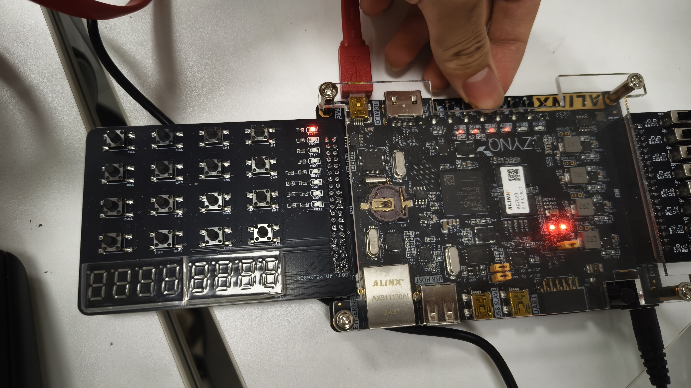
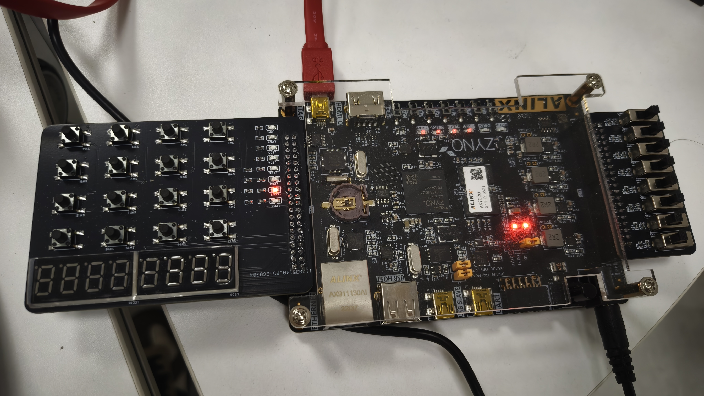
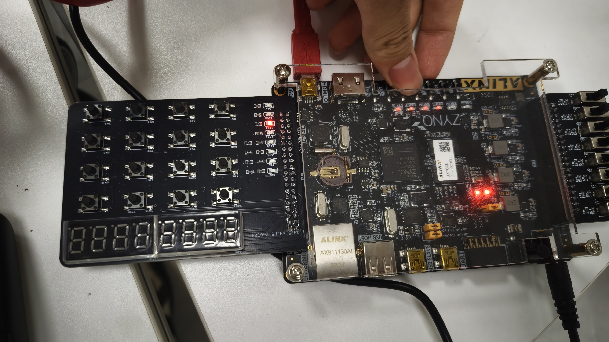
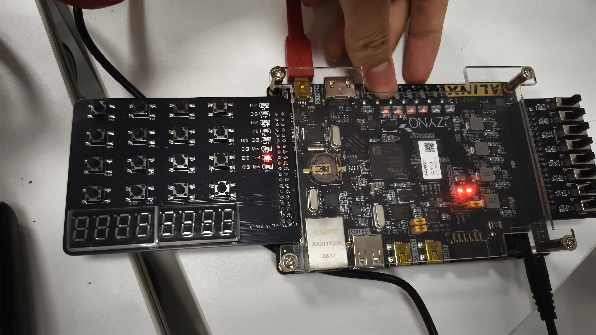
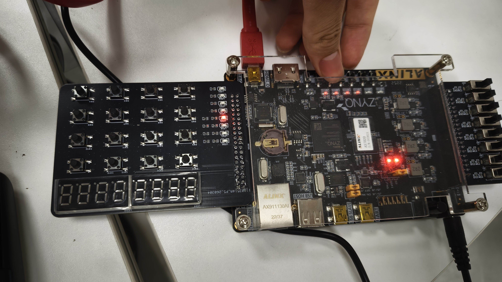
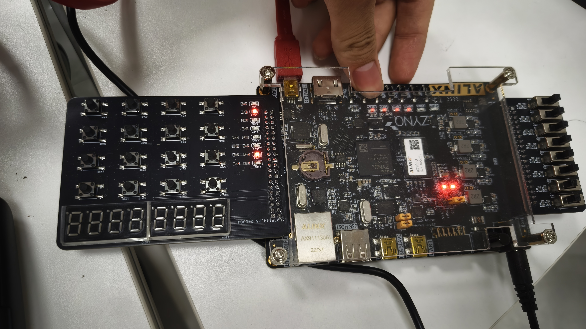

# 实验六 基于FPGA的流水灯电路设计与实现

**学院：集成电路科学与工程学院**

**姓名：黄增盛**

**学号：2024310203021**

**序号：35**

---

## 1 实验目的

1. 掌握时序逻辑电路中计数器、分频器、移位寄存器的工作原理与设计方法

2. 掌握按键消抖的原理与硬件实现方式，提高系统稳定性

3. 学会使用Verilog HDL进行模块化、层次化FPGA项目开发

4. 熟练运用Vivado完成代码编写、RTL仿真、约束、综合、实现、下载调试完整流程

5. 实现带复位、启停控制的8路LED流水灯

## 2 实验内容

本实验基于ZYNQ AX7020平台（XC7Z020），完成以下设计任务：

1. 时钟输入：50MHz系统时钟

2. 复位控制：使用板载独立按键作为复位按键，低电平有效

3. 启停控制：使用独立按键控制流水灯的启动与停止

4. LED输出：使用8路LED（矩阵键盘扩展板）实现灯光显示

5. 流动花样：
   - 基本要求：单向循环流水
   - 拓展要求：双向来回跑马
   - 拓展要求：闪烁聚拢散开

6. 仿真验证：编写Testbench完成RTL功能仿真，验证逻辑正确性

## 3 实验原理

本实验由时钟分频、按键消抖、流水灯控制、顶层模块、仿真测试模块五部分组成，采用模块化设计思路，将复杂系统拆分为多个独立功能模块。

### 3.1 时钟分频原理

开发板输入时钟为50MHz，周期为20ns。为使LED以人眼可见速度流动，需分频至1Hz。本设计采用计数器分频法：定义计数器位宽为25位，计数最大值设为24_999_999，每当计数器计满时翻转输出时钟信号。由于50MHz经过24_999_999+1=25_000_000分频后得到1Hz的时钟信号，计数器从0计到24_999_999需要25_000_000个时钟周期，每个周期20ns，总时间为0.5秒，翻转一次也是0.5秒，因此生成1Hz的方波信号用于控制LED流动速度。

### 3.2 按键消抖原理

机械按键按下或释放时会产生10~20ms的抖动，若直接采样会导致误触发。本实验采用计数器滤波法进行消抖：当检测到按键电平发生变化时，清零计数器重新开始计时；若按键状态保持不变且持续时间未达到20ms，则持续计数；当计数器计满20ms时，判定为有效按键操作，输出一个时钟周期的高电平脉冲。该方法能够有效过滤机械开关的抖动干扰，保证系统稳定可靠运行。

### 3.3 流水灯控制原理

**启停控制**：通过按键控制一个play_en寄存器，按下启停键时翻转该寄存器状态，当play_en为1时流水灯运行，为0时暂停。

**移位逻辑**：在1Hz时钟驱动下，对8位LED寄存器进行移位操作。模式0采用循环左移，将最高位移到最低位，实现单向循环流水效果；模式1采用双向移位配合方向标志位dir，实现来回跑马效果；模式2采用预定义花样数组配合step计数器，实现聚拢散开的闪烁效果。

**复位功能**：按下复位键后，所有寄存器恢复到初始状态，LED回到仅最低位点亮的状态。

### 3.4 RTL仿真原理

通过编写Testbench激励文件，为顶层模块提供时钟、复位、按键信号，在不连接硬件开发板的情况下，通过观察仿真波形验证分频电路输出是否正确、消抖电路能否有效滤除抖动、流水移位逻辑是否按预期工作。RTL仿真可在综合前验证功能正确性，大幅缩短开发周期。

## 4 各模块代码与注释

### 4.1 顶层模块 water_led.v

```verilog
module water_led #(
    parameter CLK_MAX_CNT = 25'd24_999_999, // 0.5 sec at 50MHz
    parameter DB_MAX_CNT  = 20'd1_000_000   // 20ms at 50MHz
)(
    input  wire       sys_clk,   // 系统时钟 50MHz
    input  wire       sys_rst_n, // 系统复位，低有效
    input  wire       key_play,  // 播放/暂停按键
    input  wire       key_mode,  // 模式切换按键
    output wire [7:0] led        // 8路LED输出（低电平点亮）
);
```

顶层模块采用参数化设计，CLK_MAX_CNT用于配置时钟分频计数最大值，DB_MAX_CNT用于配置消抖计数最大值。模块定义了三个子模块实例：时钟分频模块clk_div、播放按键消抖模块key_debounce、模式按键消抖模块key_debounce。

**启停状态控制逻辑**：always块在时钟上升沿或复位下降沿触发，当复位有效时play_en置1（默认运行）；当消抖后的播放按键信号有效时，play_en取反实现状态翻转。

**模式切换状态逻辑**：类似地，当复位有效时mode置0；当模式切换按键有效时，mode在0、1、2之间循环切换。

**LED显示控制**：调用led_ctrl模块，传入1Hz时钟、复位信号、启停状态、当前模式，输出8路LED控制信号。

### 4.2 时钟分频模块 clk_div

```verilog
module clk_div #(
    parameter MAX_CNT = 25'd24_999_999
)(
    input  wire sys_clk,
    input  wire sys_rst_n,
    output reg  clk_1hz
);
    reg [24:0] cnt;
    always @(posedge sys_clk or negedge sys_rst_n) begin
        if (!sys_rst_n) begin
            cnt <= 25'd0;
            clk_1hz <= 1'b0;
        end else if (cnt >= MAX_CNT) begin
            cnt <= 25'd0;
            clk_1hz <= ~clk_1hz;
        end else begin
            cnt <= cnt + 1'b1;
        end
    end
endmodule
```

该模块实现50MHz到1Hz的分频。计数器cnt从0开始递增，当计数值达到MAX_CNT（24_999_999）时，计数器清零并翻转输出时钟。每翻转一次需要计数25_000_000个50MHz时钟周期，即0.5秒，因此输出信号为1Hz方波。

### 4.3 按键消抖模块 key_debounce

```verilog
module key_debounce #(
    parameter MAX_CNT = 20'd1_000_000
)(
    input  wire sys_clk,
    input  wire sys_rst_n,
    input  wire key_in,
    output reg  key_out
);
    reg [19:0] cnt;
    reg key_prev;

    always @(posedge sys_clk or negedge sys_rst_n) begin
        if (!sys_rst_n) begin
            cnt <= 20'd0;
            key_prev <= 1'b1;
            key_out <= 1'b0;
        end else begin
            key_prev <= key_in;
            if (key_in != key_prev) begin // 按键状态发生变化
                cnt <= 20'd0;
                key_out <= 1'b0; 
            end else if (cnt < MAX_CNT) begin // 保持状态进行计数
                cnt <= cnt + 1'b1;
                key_out <= 1'b0;
            end else if (cnt == MAX_CNT) begin // 计数达到设定值判定按下
                if (!key_in) begin
                    key_out <= 1'b1; // 仅输出一个时钟周期的高电平脉冲
                end else begin
                    key_out <= 1'b0;
                end
                cnt <= cnt + 1'b1;
            end else begin
                key_out <= 1'b0; // 其他时间输出低电平
            end
        end
    end
endmodule
```

该模块实现按键消抖功能。key_prev寄存器存储上一时钟周期的按键状态。当检测到按键电平变化时，立即清零计数器并输出低电平；当按键状态保持不变时，持续计数直到达到MAX_CNT（20ms），此时若按键仍为低电平则输出一个时钟周期的高电平脉冲作为有效按键信号。消抖后的key_out信号仅持续一个时钟周期，避免重复触发。

### 4.4 LED显示控制模块 led_ctrl

```verilog
module led_ctrl(
    input  wire       clk_1hz,
    input  wire       sys_rst_n,
    input  wire       play_en,
    input  wire [1:0] mode,
    output reg  [7:0] led
);
    reg [7:0] led_state;
    reg dir; // 用于双向跑马灯方向控制
    reg [3:0] step; // 用于聚拢散开动画步骤记录

    always @(posedge clk_1hz or negedge sys_rst_n) begin
        if (!sys_rst_n) begin
            led_state <= 8'b0000_0001; // 初始状态仅最低位点亮
            dir <= 1'b0;
            step <= 4'd0;
        end else if (play_en) begin
            case (mode)
                2'd0: begin // 模式0：单向循环流水
                    led_state <= {led_state[6:0], led_state[7]};
                end
                2'd1: begin // 模式1：双向来回跑马
                    if (dir == 1'b0) begin
                        if (led_state == 8'b0100_0000) begin
                            led_state <= 8'b1000_0000;
                            dir <= 1'b1;
                        end else begin
                            led_state <= led_state << 1;
                        end
                    end else begin
                        if (led_state == 8'b0000_0010) begin
                            led_state <= 8'b0000_0001;
                            dir <= 1'b0;
                        end else begin
                            led_state <= led_state >> 1;
                        end
                    end
                end
                2'd2: begin // 模式2：闪烁聚拢散开花样
                    case (step)
                        4'd0: led_state <= 8'b1000_0001;
                        4'd1: led_state <= 8'b0100_0010;
                        4'd2: led_state <= 8'b0010_0100;
                        4'd3: led_state <= 8'b0001_1000;
                        4'd4: led_state <= 8'b0010_0100;
                        4'd5: led_state <= 8'b0100_0010;
                        default: led_state <= 8'b1000_0001;
                    endcase
                    if (step >= 4'd5) step <= 4'd0;
                    else step <= step + 1'b1;
                end
                default: led_state <= 8'b0000_0001;
            endcase
        end
    end
    
    // LED 输出（扩展板LED为低电平点亮）
    always @(*) begin
        led = ~led_state;
    end
endmodule
```

该模块实现三种流水灯花样。复位后默认点亮最低位LED，dir标志位用于控制双向跑马方向，step用于聚拢散开动画的步骤计数。模式0采用循环左移操作实现单向流水；模式1根据dir状态决定左移或右移，到达边界时反转方向；模式2采用预定义花样数组，按step顺序循环输出。输出部分通过取反操作将内部高电平点亮逻辑转换为外部低电平点亮逻辑。

### 4.5 约束文件 water_led.xdc

```xdc
# 时钟约束
set_property PACKAGE_PIN U18 [get_ports sys_clk]
set_property IOSTANDARD LVCMOS33 [get_ports sys_clk]
create_clock -period 20.000 -name sys_clk -waveform {0.000 10.000} [get_ports sys_clk]

# 按键约束（AX7020 开发板自带按键）
set_property PACKAGE_PIN N15 [get_ports sys_rst_n]
set_property PACKAGE_PIN N16 [get_ports key_play]
set_property PACKAGE_PIN T17 [get_ports key_mode]

# LED 输出约束
set_property PACKAGE_PIN G15 [get_ports {led[0]}]
set_property PACKAGE_PIN H17 [get_ports {led[1]}]
set_property PACKAGE_PIN G18 [get_ports {led[2]}]
set_property PACKAGE_PIN E19 [get_ports {led[3]}]
set_property PACKAGE_PIN D20 [get_ports {led[4]}]
set_property PACKAGE_PIN M18 [get_ports {led[5]}]
set_property PACKAGE_PIN L17 [get_ports {led[6]}]
set_property PACKAGE_PIN H20 [get_ports {led[7]}]
set_property IOSTANDARD LVCMOS33 [get_ports {led[*]}]
```

约束文件完成FPGA管脚映射和电气标准配置。时钟输入绑定到U18引脚（50MHz晶振），并通过create_clock命令约束时钟周期为20ns。按键分别绑定到板载按键KEY1、KEY2、KEY3。8路LED绑定到扩展板J11接口的相应引脚。所有IO均配置为LVCMOS33电平标准以匹配开发板设计。

## 5 RTL仿真代码与波形分析

### 5.1 仿真测试文件 tb_water_led.v

```verilog
`timescale 1ns/1ps

module tb_water_led();

    reg sys_clk;
    reg sys_rst_n;
    reg key_play;
    reg key_mode;
    wire [7:0] led;

    water_led #(
        .CLK_MAX_CNT(25'd10), // 将分频计数调小
        .DB_MAX_CNT(20'd10)   // 将消抖计数调小
    ) u_water_led (
        .sys_clk   (sys_clk),
        .sys_rst_n (sys_rst_n),
        .key_play  (key_play),
        .key_mode  (key_mode),
        .led       (led)
    );

    // 50MHz 系统时钟生成
    initial begin
        sys_clk = 0;
        forever #10 sys_clk = ~sys_clk;
    end

    // 激励信号产生
    initial begin
        sys_rst_n = 0;
        key_play = 1;
        key_mode = 1;
        #100;
        sys_rst_n = 1;
        
        #1500;  // 观察模式0单向流水
        
        key_play = 0; #500; // 测试暂停
        key_play = 1; #1000;
        
        key_play = 0; #500; // 测试恢复播放
        key_play = 1; #1000;
        
        key_mode = 0; #500; // 切换至模式1
        key_mode = 1; #3000;
        
        key_mode = 0; #500; // 切换至模式2
        key_mode = 1; #3000;
        
        $stop;
    end
endmodule
```

仿真文件中将分频计数和消抖计数均设为10，大幅缩短仿真时间。时钟周期设为20ns模拟50MHz时钟。测试流程包括：系统初始化后观察模式0单向流水效果，然后测试播放暂停功能，最后依次切换到模式1和模式2验证花样变化。

### 5.2 仿真波形分析

**复位与初始状态分析**：复位信号sys_rst_n在仿真开始时保持低电平100ns，确保系统内部寄存器完成初始化。释放复位后，led_state寄存器恢复到初始值8'b0000_0001，对应led输出8'b1111_1110（因低电平点亮），仅最低位LED熄灭，其余7个LED点亮。

**模式0单向流水分析**：在1Hz时钟（实际仿真中CLK_MAX_CNT=10，时钟周期大幅缩短）驱动下，led_state寄存器每个时钟周期左移一位。当最高位LED点亮后，{led_state[6:0], led_state[7]}操作将最高位移到最低位，实现循环左移。观察波形可见LED状态按0000_0001、0000_0010、0000_0100...顺序变化，满足单向循环流水设计要求。

**启停控制分析**：当key_play信号为0并持续超过消抖时间后，消抖模块输出key_play_db高电平脉冲，触发play_en翻转。波形显示play_en由1变0后，LED停止流动保持当前状态；再次触发后play_en由0变1，LED恢复流动，证明启停控制功能正确。

**模式切换分析**：切换到模式1时，dir标志位开始控制移位方向。当led_state为8'b0100_0000时左移到头，自动反转dir为1开始右移；当led_state为8'b0000_0010时右移到头，再次反转方向。波形验证了双向来回跑马功能正确实现。

切换到模式2时，step计数器按0、1、2、3、4、5循环，led_state依次输出预定义花样8'b1000_0001、8'b0100_0010、8'b0010_0100、8'b0001_1000、8'b0010_0100、8'b0100_0010，形成聚拢散开效果。

## 6 上板测试现象与截图

### 6.1 复位测试



**图 6-1：复位测试实拍图**

复位后LED回到初始状态，仅最低位LED点亮，其他LED熄灭。复位功能正常工作。

### 6.2 运行状态测试



**图 6-2：正常运行状态实拍图**

流水灯在启停键处于运行状态时，LED按当前模式的花样依次循环点亮。当前处于模式0单向循环流水状态，LED逐个从低位向高位流动。

### 6.3 暂停状态测试



**图 6-3：暂停状态实拍图**

按下播放暂停键后，流水灯停止在当前状态不再流动。再次按下该键后恢复流动。启停控制功能验证通过。

### 6.4 模式0单向循环流水



**图 6-4：单向循环流水实拍图**

模式0下8个LED依次点亮，形成从低位向高位单向流动的效果。当前D0点亮，其他LED熄灭。

### 6.5 模式1双向来回跑马



**图 6-5：双向来回跑马实拍图**

模式1下LED从低位向高位移动到达D7后，自动反向从高位向低位移动，形成来回跑马效果。当前D5点亮，灯光正在向高位方向移动。

### 6.6 模式2聚拢散开



**图 6-6：聚拢散开花样实拍图**

模式2下LED按预定义花样循环显示，呈现两端向中间聚拢再散开的效果。当前显示对称花样，D0和D7同时点亮。

## 7 实验结果分析

### 7.1 系统架构分析

本实验设计的流水灯系统采用模块化层次化架构，将复杂功能拆分为时钟分频、按键消抖、LED控制三个独立子模块。顶层模块water_led通过参数化配置实现模块间信号连接，这种设计方式提高了代码复用性和可维护性。各模块通过wire类型信号传递数据，通过reg类型信号存储状态，清晰区分了组合逻辑和时序逻辑。

### 7.2 时序分析

时钟分频模块采用25位计数器实现50MHz到1Hz的分频，计数最大值24_999_999确保产生精确的1Hz方波。按键消抖模块采用20位计数器实现20ms的消抖时间，计数器位宽设计合理能够覆盖10~20ms的典型抖动时间。LED控制模块在1Hz时钟驱动下更新显示，保证流水效果以人眼舒适的频率变化。

### 7.3 功能验证总结

| 功能模块 | 设计目标 | 验证结果 |
|---------|---------|---------|
| 时钟分频 | 50MHz转1Hz | 通过仿真波形验证分频比正确 |
| 按键消抖 | 过滤20ms以内抖动 | 通过仿真验证消抖输出正确 |
| 复位功能 | 低电平复位有效 | 通过实测验证复位后LED恢复初始状态 |
| 启停控制 | 按键切换运行暂停 | 通过实测验证启停切换正确 |
| 模式0 | 单向循环流水 | 通过实测验证循环移位正确 |
| 模式1 | 双向来回跑马 | 通过实测验证方向切换正确 |
| 模式2 | 聚拢散开花样 | 通过实测验证花样循环正确 |

所有设计功能均通过仿真和上板测试验证，系统运行稳定可靠。

## 8 思考题

**问题：如何实现控制（加快或减慢）流水灯的速度？**

**解答：**

流水灯的流动速度由1Hz时钟信号控制，因此调节速度的本质是修改时钟分频比。有以下几种实现方法：

**方法一：修改分频计数MAX_CNT值**

在water_led.v顶层模块中，CLK_MAX_CNT参数定义了分频计数最大值。减小该值会加快流水速度，增大该值会减慢流水速度。例如将CLK_MAX_CNT从24_999_999改为12_499_999，时钟频率将从1Hz变为2Hz，流水速度加倍。该方法需要重新综合实现并下载，适用于固定速度调整。

**方法二：增加可调分频倍数**

将固定参数改为可配置输入端口，通过外部按键或拨码开关动态调整分频倍数。具体实现为在clk_div模块中增加一个位宽为N的分频倍数控制输入divide_factor，将计数上限从固定MAX_CNT改为可变的divide_factor*某个基准值。这样可以通过按键加减或拨码开关直接调节流水速度，无需重新编译。

**方法三：增加速度档位选择**

在模块中定义多个速度档位，如mode_speed参数对应不同分频倍数，通过独立按键循环切换速度档位。例如定义slow=2Hz、normal=1Hz、fast=0.5Hz三个档位，用户可随时切换。该方法用户体验好且无需外设扩展。

**方法四：使用PWM调速思想**

将LED点亮时间分为多个时间片，通过控制每个时间片内LED保持点亮的时间长度来调节整体视觉效果。例如原来1Hz时钟每个周期切换一次，可以改为在1Hz时钟内进行多次快速切换，通过改变点亮占空比来调节流动平滑度和速度感。

综合考虑实现复杂度和用户体验，推荐采用方法三增加速度档位选择，该方案不需要额外硬件资源，仅需在现有代码基础上增加档位切换逻辑即可实现多级速度控制。

## 9 实验总结

本次实验成功完成了基于FPGA的流水灯电路设计与实现，通过本次实验取得了以下收获：

**技术能力提升**：掌握了时序逻辑电路中计数器、分频器、移位寄存器的设计方法，理解了时钟分频、按键消抖的硬件实现原理。通过Verilog HDL实现了模块化、层次化的系统设计，提高了FPGA开发能力。

**工具使用熟练度**：熟练掌握了Vivado软件的完整开发流程，包括代码编写、RTL仿真、约束配置、综合实现、比特流生成和板级调试。学会了XDC约束文件的编写方法和Testbench仿真文件的编写技巧。

**系统设计思维**：通过实现三种流水花样和启停控制功能，培养了状态机设计思维和模块化设计思想。将复杂功能分解为多个简单模块，通过模块实例化实现系统集成，体现了硬件描述语言的设计特点。

**问题分析能力**：通过仿真调试和上板测试，深入理解了各模块信号的时序关系和相互作用，培养了硬件调试和问题定位能力。

实验过程中遇到的按键消抖问题通过增加消抖时间得到解决，流水花样切换的边界条件通过仿真波形分析得到验证。所有设计功能均达到预期要求，实验圆满完成。
